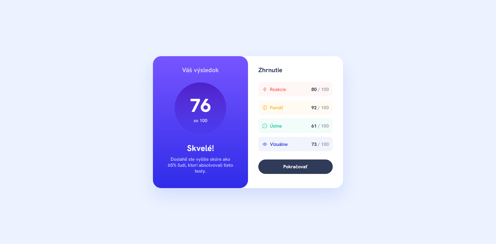
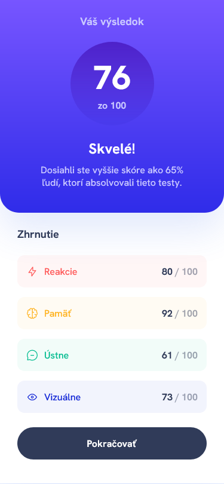

# Frontend Mentor - Result summary component

## 📝 Informácie o projekte

Tento projekt je zo stránky [Frontend Mentor](https://www.frontendmentor.io/challenges/results-summary-component-CE_K6s0maV). Stránka Frontend Mentor je online platforma určená pre webových vývojárov, ktorí sa chcú zdokonaliť v oblasti frontendu. Obsahuje rôzne projekty, ktoré sú zamerané na vývoj webových stránok a aplikácií, a ktoré majú rôzne náročnosti a témy. Na stránke nájdete kompletné zadania projektov, ktoré obsahujú náhľady dizajnu, napríklad vo Figme.

Používatelia tejto stránky môžu:

- prezerať si ju na desktope, tablete alebo na mobilnom zariadení
- vidieť interaktívne prvky pri prechádzaní stránkou

Po kliknutí na logo sa zobrazí môj predchádzajúci [projekt](https://github.com/tomasdunik/frontend-mentor__typemaster-pre-launch-landing-page).

#### [Odkaz na hotovú stránku](https://tomasdunik.github.io/frontend-mentor__results-summary-component/)

 

## 🏗️ Vytvorenie projektu

Vytvorenie projektu mi trvalo približne 3 hodiny (čas od stiahnutia projektu až po jeho finálne publikovanie na stránke Frontend Mentor). Použil som HTML a SCSS. Projekt má responzívny dizajn pre desktop a mobilné zariadenia. Anglické texty som upravil na slovenské.

 

## 🛠️ Vytvorené s

- HTML
- CSS
- SCSS

 

## 📸 Screenshots

### 💻 Desktop

### 📱 Mobil

 

## 🔗 Projekty Frontend Mentor

- [Tento konkrétny projekt na stránke Frontend Mentor](https://www.frontendmentor.io/solutions/my-version-results-summary-component-a45p4u7tI1)
- [Moje ostatné projekty na stránke Frontend Mentor](https://www.frontendmentor.io/profile/WeekendsProgrammer)
